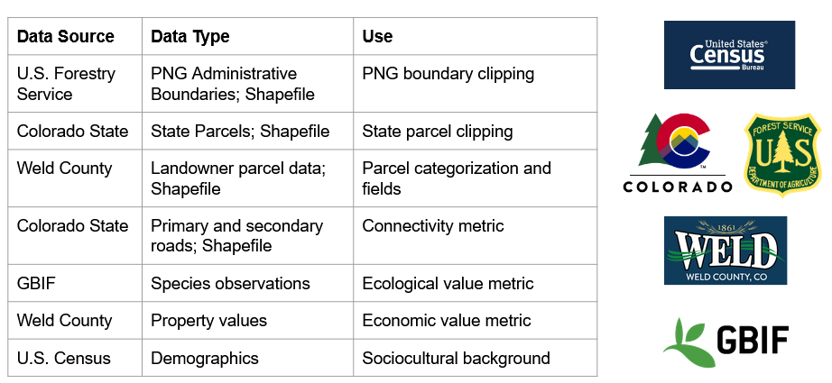

### Final Project for GEOG 4563-5563: Earth Analytics Applications

### Our Team:
- Kayleigh Ward
- Nate Hofford
- Max Warnock

### Project Background:
This project centers around using geospatial and species data to optimize potential land swaps on the Pawnee National Grassland to consolidate ownership and de-fragment habitat. Our goal is create a public tool to identify these land swaps, and provide evidence for recommendations for state agencies. 

### Goals:
1. Create a tool that analyzes ownership patterns and measure fragmentation of federally owned land. [summer]
2. Identify high-impact parcels whose transfer would objectively maximize consolidation of federally owned land.
3. Synthesize recommendations for agencies to achieve various goals [summer]

### Data Overview:
  

### Pawnee National Grasslands Property Boundary Data

<embed type="text/html" src="/figures/boundary_figures/pawnee_boundary_plot.html" width="600">

<embed type="text/html" src="/figures/boundary_figures/west_pawnee_boundary_plot.html" width="600">

<embed type="text/html" src="/figures/animals/gbif_animals_clipped_map.html" width="600">

