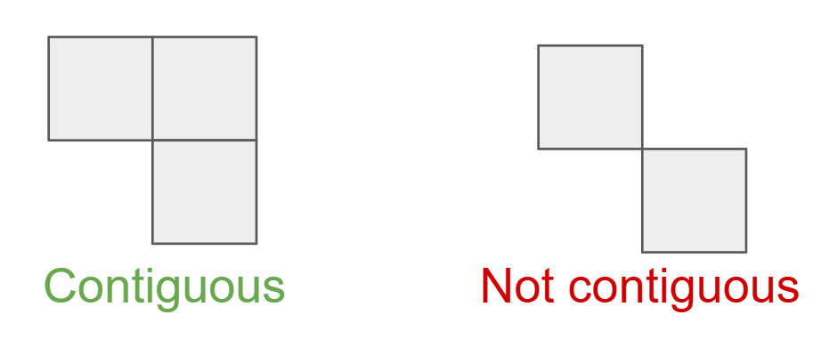
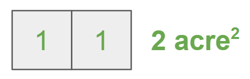
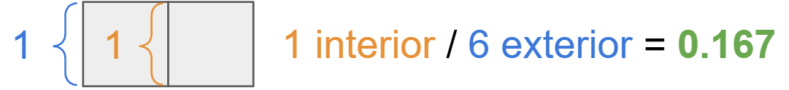

### Final Project for GEOG 4563-5563: Earth Analytics Applications

### Our Team:
- Kayleigh Ward
- Nate Hofford
- Max Warnock

### Project Background:
This project centers around using geospatial and species data to optimize potential land swaps on the Pawnee National Grassland to consolidate ownership and de-fragment habitat. Our goal is create a public tool to identify these land swaps, and provide evidence for recommendations for state agencies. 

### Goals:
1. Create a tool that analyzes ownership patterns and measure fragmentation of federally owned land. [summer]
2. Identify high-impact parcels whose transfer would objectively maximize consolidation of federally owned land.
3. Synthesize recommendations for agencies to achieve various goals [summer]

### Data Overview:
  

### Pawnee National Grasslands Property Boundary Data
<embed type="text/html" src="/figures/boundary_figures/pawnee_boundary_plot.html" width="600">

<embed type="text/html" src="/figures/boundary_figures/west_pawnee_boundary_plot.html" width="600">

### Herbivores of Pawnee National Grassland
<embed type="text/html" src="/figures/animals/gbif_animals_clipped_map.html" width="600">

### Grasses of Pawnee National Grassland

### Contiguous Area Measures
We built two evaluation criteria to measure contiguous area within Pawnee National Grassland. First, we defined contiguous patches for Federal parcels. These were defined as any two parcels that share at least one side. Touching corners did not count as contiguous.

  
***Figure n:*** (Left) Contiguous patches share at least one side. (Right) Parcels touching corners were not considered contiguous.

We then evaluated total area of eall contiguous patches to determine the largest Federal holdings. Optimizing for total area would allow managers to apply treatment to broader areas of land. 

***Figure n:*** Total area calculation.

Exterior edges of patches represent land that PNG cannot manage. To understand how compact each patch was, we calculated an interior edge ratio. This ratio is the sum of the interior edge lengths / sum of the exterior edge lengths. More compact patches will have a higher interior edge ratio. These compact patches minimize the interface between managed land and unmanaged land.

***Figure n:*** Edge ratio calculation.

We end up with two maps of federal patches colored by total area and internal edge ratio. Patches with high total area and high internal edge ratio would be candidates for recieving land swap. Low scores across these two metrics would be candidates for an outgoing swap.

<embed type="text/html" src="figures/contiguous/federal_patches_map.html" width="900" height="600">
***Figure n:*** (Left) Total area patches, colored by area rank. Green patches have a higher total area compared to red patches. (Right) Interior edge patches, colored by score. Green patches have a higher ratio of interior edges.

